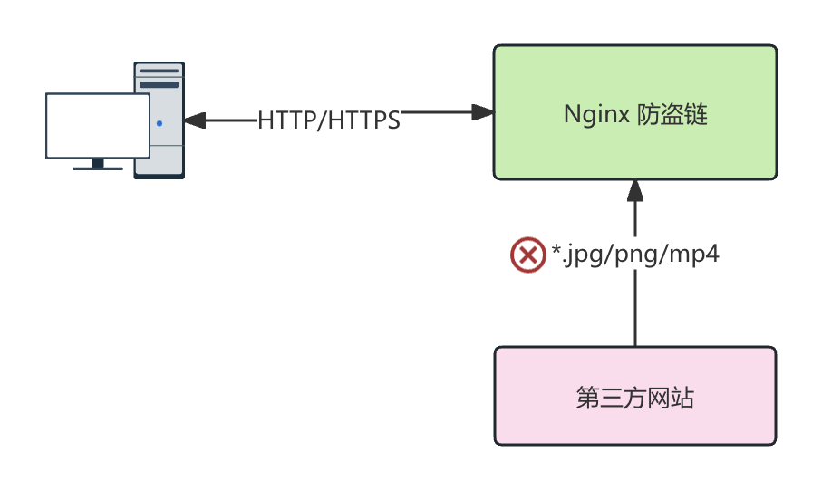

# 防盗链

防盗链是一个用于防止其他网站盗用自身网站资源的安全机制。

## 使用场景

如果有第三方的网站未经授权直接引用我们网站的图片，视频等资源，当用户访问这些第三方网站时，实际上加载的资源是来自于我们的网站，从而导致服务器的资源开销增加。



## 配置

在 Nginx 中，通过配置 `Referer` 请求头的验证，可以实现有效的防盗链。

```nginx
server {
    listen 80;
    server_name example.com;

    location /images/ {
        valid_referers none blocked example.com *.example.com;

        if ($invalid_referer) {
            return 403; # 禁止访问
        }

        root /var/www/html;
    }
}
```

上述示例实现了阻止非授权来源的图片访问。其中，授权列表通过 `valid_referers` 指令定义了允许的来源列表。如果请求的 `Referer` 无效，则直接 `403` 进制访问。如果您希望为非法请求返回一个替代的图片提示，可以使用 `rewrite` 指令重写资源地址。

```nginx
server {
    listen 80;
    server_name example.com;

    location /images/ {
        valid_referers none blocked example.com *.example.com;

        if ($invalid_referer) {
            rewrite ^/images/.*$ /images/anti_hotlink.jpg last; # [!code focus]
        }

        root /var/www/html;
    }
}
```
