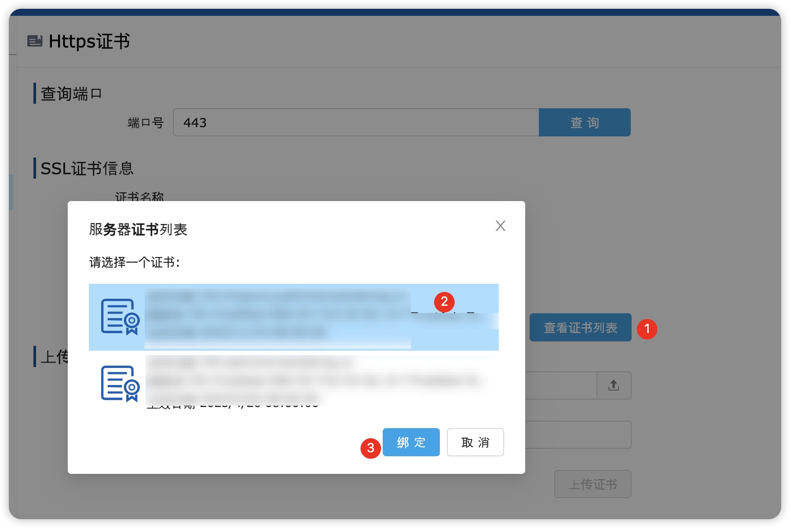

# HTTPS

HTTPS（HyperText Transfer Protocol Secure）是基于 HTTP 的安全通信协议，通过 SSL/TLS（安全套接字层/传输层安全性协议）对数据进行加密，确保数据在客户端和服务器之间的传输过程中安全。

相比于 HTTP，HTTPS 的数据传输都是经过加密的，这就保证了数据在客户端与服务器之间的传输过程中安全。此外，HTTPS 还具备身份验证、防篡改、防窃听等多个安全优势。因此，现代浏览器的很多涉及到安全的功能都强制要求网站是 HTTPS。

## 为活字格网站启用 HTTPS。

1. 获取数字认证证书。

    认证证书确保通信的安全性和身份的可信性，因此，是 HTTPS 的必备文件。如何获取证书，可以参考[这里](./ssl-cert)。

2. 进入活字格管理控制台，「设置 -> Https 证书」。
3. 在「上传证书到服务器」中进行证书的上传。
    > [!IMPORTANT]
    > 活字格管理控制台仅支持 `.pfx` 格式的证书。
4. 在「查询端口」处搜索您需要配置成 HTTPS 的应用端口号。
5. 为应用端口号绑定证书。「查看证书列表 -> 选择证书，点击绑定」



## 使用 Nginx 代理 HTTPS

如果您的活字格应用有使用 Nginx 做反向代理，可以直接将证书绑定在 Nginx 上，这样无需为每个活字格应用都绑定证书，也可以实现 HTTPS 的访问。

```nginx
server {
    listen 80;
    server_name example.com www.example.com;
    return 301 https://$host$request_uri; # 强制 HTTP 跳转到 HTTPS
}

server {
    listen 443 ssl;
    server_name example.com www.example.com;

    ssl_certificate /path/to/fullchain.pem; # 证书文件
    ssl_certificate_key /path/to/privkey.pem; # 私钥文件

    ssl_protocols TLSv1.2 TLSv1.3; # 启用安全的 TLS 协议
    ssl_ciphers HIGH:!aNULL:!MD5; # 配置加密套件

    root /var/www/html;
    index index.html index.htm;

    location / {
        try_files $uri $uri/ =404;
    }
}
```

其中，证书文件和私钥文件的格式可以是 `pem` 格式，也可以是 `crt` 与 `key` 的格式。

> [!IMPORTANT]
> 为了确保用户体验无感，强烈建议配置 80 端口的重定向，强制跳转至 HTTPS 端口。
