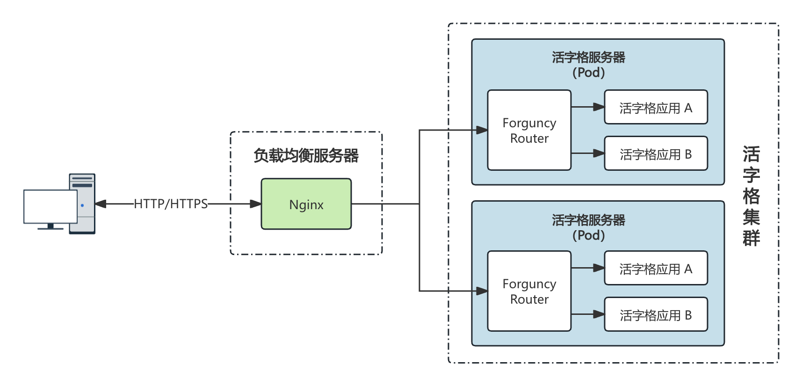

# 负载均衡

将 Nginx 作为一个负载均衡器，以应对高并发的场景。

## 使用场景

用户访问 Nginx，Nginx 再将请求转发至后端的活字格多台服务器上，来提供活字格服务器高可用与高并发的能力。用于[活字格的集群场景](../load-balance/introduction)。



## 配置

Nginx 通过 `upstream` 指令来定义后端多台服务器 IP 地址和端口。之后在 `location` 中通过 `proxy_pass` 指令来指定 `upstream` 的名称。这样就可以将请求转发到定义的 `upstream` 这个组中的服务器。

```nginx {2}
upstream fgc_servers {
  ip_hash;
  server 192.168.1.100:31291;
  server 192.168.1.101:31291;
  server 192.168.1.102:31291;
}

server {
  listen 80;
  server_name _;
  location /app {
    proxy_pass http://fgc_servers/app;
    proxy_set_header Host $host;
    proxy_set_header X-Real-IP $remote_addr;
  }
}
```

> [!TIP]
>
> -   `fgc_servers` 为活字格集群的节点组，其中每个 IP 都是节点的 IP，而不是 Pod 的 IP。
> -   `31291` 为集群的 fgc-service 对外暴露的服务端口，详情可参考[文档](../load-balance/chart-install#expose_service)。

Nginx 提供了丰富的流量分发算法。上述配置中高亮的 `ip_hash` 就是其中的一种。如果在 upstream 中不做任何配置，Nginx 会使用默认的轮询转发，即配置的多台 web 服务器，它会轮询的转发。

| 算法         | 配置指令示例                  | 适用场景                                     |
| ------------ | ----------------------------- | -------------------------------------------- |
| 轮询         | 无                            | 后端服务器性能一致，简单场景。               |
| 加权轮询     | 在 server 后追加 weight       | 后端服务器性能不一致，需要按比例分发流量。   |
| IP 哈希      | ip_hash;                      | 需要会话保持，例如用户登录。活字格集群推荐。 |
| 最少连接     | least_conn;                   | 请求处理时间不一致，适合动态负载分配。       |
| 一致性哈希   | hash $request_uri consistent; | 缓存或会话场景，减少服务器变动带来的影响。   |
| 随机         | random two;                   | 简单的负载均衡，结合权重提供更灵活的分配。   |
| 最短响应时间 | least_time header;            | 追求最快的响应速度，需要更精确的负载均衡。   |
