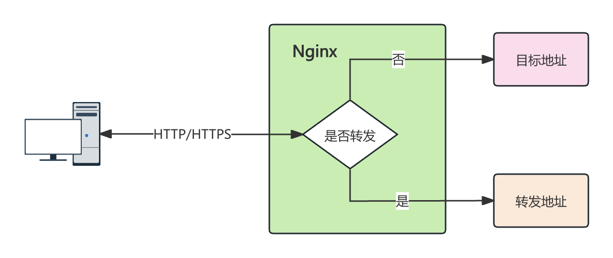

# 重定向

重定向（Redirect）是指服务器向客户端发送一个特殊的响应指令，告知浏览器或客户端应重新请求另一个 URL。

## 使用场景

通过重定向，用户的请求会被转发到指定的新地址。这是活字格应用长期维护中必然会遇到的场景，诸如：

-   网站迁移，希望老客户访问服务的地址不变，将旧地址的流量导入到新地址上，一般用在网站升级、域名更新等场景。
-   HTTPS 强制跳转，强制用户访问 HTTPS 版本的站点，但是客户本身的访问行为无感。
-   URL 规范化，避免 URL 重复索引，例如将 `www.example.com` 统一重定向至 `example.com`。
-   页面移动，将旧的页面地址重定向到新地址上，避免用户在访问时出现页面无法访问的错误。



## 配置

Nginx 提供 `rewrite` 指令实现重定向功能。

```nginx
# HTTPS 强制跳转
server {
  listen 80;
  server_name example.com;
  return 301 https://example.com$request_uri;
}

# 将旧站点转移到新站点上
server {
  listen 80;
  server_name oldsite.com；
  return 301 https://newsite.com$request_uri;
}

# 将 www.example.com 统一为 example.com 访问
server {
  server_name www.example.com;
  return 301 https://example.com$request_uri;
}
```

其中：

-   `301` 是 HTTP 请求中重定向的状态码，用于告知客户端该请求被重定向，资源永久移动到新地址。搜索引擎会更新索引，新地址会被缓存。

-   `$request_uri`为客户端请求的完整原始 URI。重定向时需要将客户端的请求路径和查询参数原封不动地转发到新地址。
