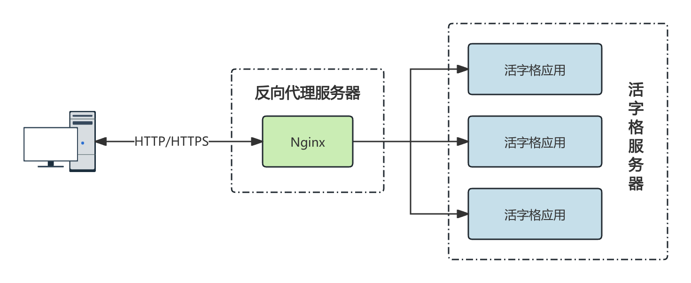

# 反向代理

使用反向代理，也是 Nginx 的一种常见的使用方法，也是活字格应用场景中使用 Nginx 的主要场景。

## 使用场景

Nginx 作为网站的访问入口，用户先访问 Nginx，Nginx 再将请求转发至活字格服务器，接收到活字格服务器的返回结果后后再响应给客户。

活字格支持在一台服务器上发布多个应用，使用反向代理的目的是为了隐藏后端的真实服务，统一的对外暴露访问，提高活字格服务器的安全性。



## 配置

反向代理的配置也很简单。只需要在 `location` 块中，通过 `proxy_pass` 指令来指定后端访问地址就可以了。

```nginx
server {
  listen 80;
  server_name _;
  location /UserService {
    proxy_pass http://192.168.1.10:22345/UserService;
    proxy_set_header Host $host;
    proxy_set_header X-Real-IP $remote_addr;
  }

  location /app {
    proxy_pass http://192.168.1.10:8080/app;
    proxy_set_header Host $host;
    proxy_set_header X-Real-IP $remote_addr;
  }
}
```

上述配置针对于活字格的管理控制台服务和 app 应用做了两个反向代理。

-   假设活字格的服务地址是 `192.168.1.10`。
-   当用户在地址栏输入的地址是 `/UserService`时，会被代理到活字格的管理控制台路径。
-   当用户在地址栏输入的地址是 `/app`时，会被代理到活字格应用 app 上。这个应用发布的端口是 8080。

> [!NOTE]
> 在代理请求时更好地传递客户端的真实信息，确保后端服务器处理逻辑的准确性和日志记录的完整性。需要在 Nginx 上使用 `proxy_set_header` 指令显示的设置头信息：
>
> -   `Host` : 识别请求是针对哪个主机名的。
> -   `X-Real-IP` : 获取客户端的真实请求 IP 地址。
>
> 如果您需要处理多级代理的情况，还可以使用如下设置：
>
> ```nginx
> proxy_set_header X-Forwarded-For $proxy_add_x_forwarded_for;
> ```
