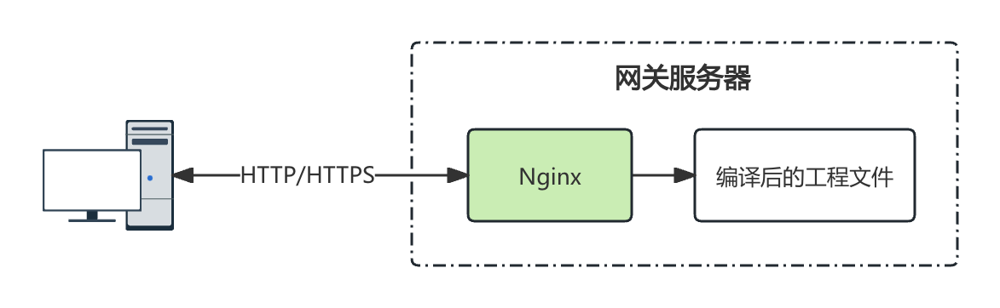

# Web 服务器

将 Nginx 作为一台 Web 服务器来提供静态网站服务，是 Nginx 最常见的使用方法。

## 使用场景

对于活字格的应用来说，活字格服务器程序本身就是一台 web 服务器，无需 Nginx 提供相应的静态网站服务。但是在实际的实施场景中，经常会遇到前端页面使用 Vue / React 等框架开发前端页面，活字格负责后端的业务服务。此时，前端页面需要构建一个 Web 服务才能为最终客户提供页面访问的能力。这时，Nginx 的价值就可以提现出来。事实上，这也是现在广大前端项目广泛使用 Nginx 的原因。



## 配置

Nginx 作为 Web 服务器的配置非常简单，只需要在 `location` 块中通过 `root` 指令来指定网站根目录即可。

```nginx
server {
  listen 80;
  server_name _;
  location / {
    root /var/www/root;
    index index.html index.htm;
  }
}
```

如果需要配置 HTTPS，只需要监听端口从 `80` 变更为 `443`，并配置 SSL 的两个参数指定证书和私钥就可以了。

```nginx{2,4,5}
server {
  listen 443;
  server_name _;
  ssl_certificate /path/to/certificate.crt;
  ssl_certificate_key /path/to/private-key.key;
  location / {
    root /var/www/root;
    index index.html index.htm;
  }
}
```

> [!NOTE]
> SSL 证书可以通过各大云服务厂商进行申请。如果您是内网环境，也可以考虑使用[自认证证书](./ssl-cert#自认证证书)，自行构建证书和密钥。
