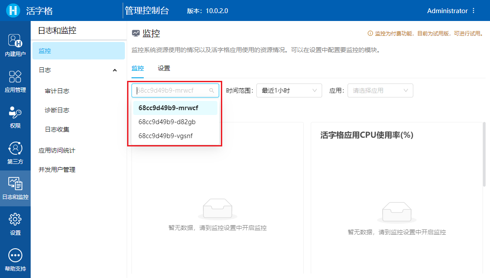
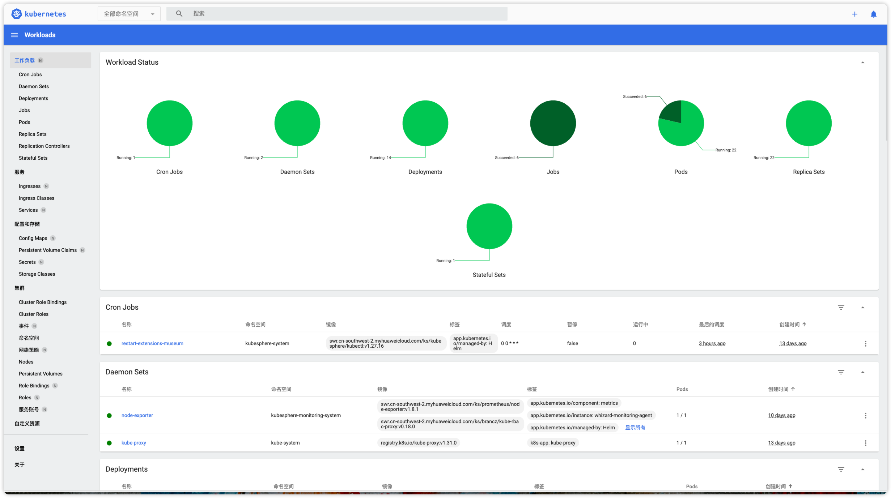
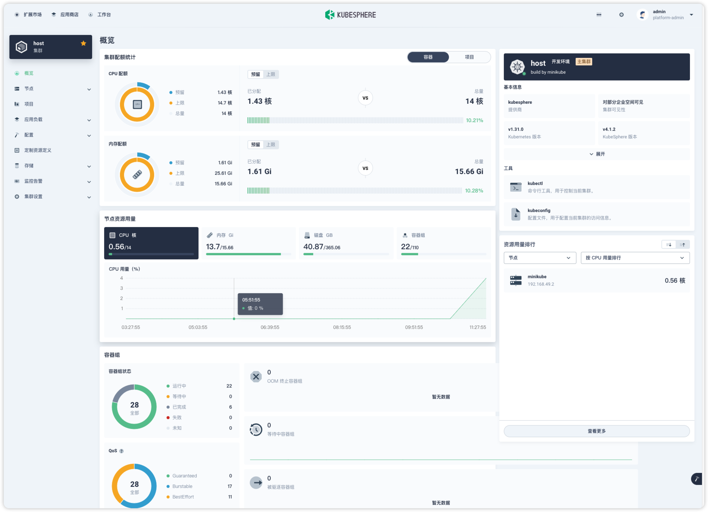

# 可视化

本节介绍活字格集群下的可视化监控。

## 活字格监控

活字格的管理控制台中提供了可视化的监控，包含了系统资源的使用、活字格应用与相关进程的调用情况以及活字格运行的全部系统日志与业务日志。您可以进入管理控制台中「日志与监控」进行查看。

相比于单点下的活字格监控，活字格集群的监控提供了以 Pod 为维度的监控方式。您可以指定任意一个 Pod 查看其运行情况：



如果您希望多了解在活字格下监控相关的知识，请参阅[这里](../log-monitor/introduction)进行学习。

## Kubernetes 监控

除了活字格应用层面的监控，您也需要了解 Kubernetes 集群的运行情况。Kubernetes 的可视化方案有很多：

-   Kubernetes Dashboard；
-   KubeSphere；
-   kuboard；
-   其他。

您可以选择适合您需求的方案进行安装。这里为您提供两种监控的安装方式。

### Kubernetes Dashboard

[Kubernetes Dashboard](https://kubernetes.io/zh-cn/docs/tasks/access-application-cluster/web-ui-dashboard/) 是 Kubernetes 官方提供的一个基于 Web 的用户界面，用于管理和可视化 Kubernetes 集群的资源。通过 Dashboard，您可以更直观地查看和管理集群中的资源，例如 Pods、Deployments、Services、Nodes 等。

您可以通过 Helm 快速安装 Kubernetes Dashboard。

```bash
# 添加 kubernetes-dashboard 仓库
helm repo add kubernetes-dashboard https://kubernetes.github.io/dashboard/

# 使用 kubernetes-dashboard Chart 部署名为 `kubernetes-dashboard` 的 Helm Release
helm upgrade --install kubernetes-dashboard kubernetes-dashboard/kubernetes-dashboard --create-namespace --namespace kubernetes-dashboard
```

首次安装后，会自动代理服务，并将访问地址在控制台输出。后面运行需要您手动代理地址。

```bash
# 此时访问当前地址的 8443 端口即可
kubectl -n kubernetes-dashboard  port-forward svc/kubernetes-dashboard-kong-proxy 8443:443
```

如果不希望每次手动代理，可以自行修改配置，将 Service 的类型改为 `NodePort`。

为了保护集群数据，默认情况下，Dashboard 会使用最少的 RBAC 配置进行部署。 当前，Dashboard 仅支持使用 Bearer 令牌登录。因此，您需要构建一个具备权限的 `Service Account`，并在每次访问时生成相应的令牌进行访问。您可以参阅[官方文档](https://kubernetes.io/zh-cn/docs/tasks/access-application-cluster/web-ui-dashboard/#accessing-the-dashboard-ui)了解更多。

创建 `Service Account` 并绑定相应权限角色：

```yaml
apiVersion: v1
kind: ServiceAccount
metadata:
    name: admin-user
    namespace: kubernetes-dashboard
---
apiVersion: rbac.authorization.k8s.io/v1
kind: ClusterRoleBinding
metadata:
    name: admin-user
roleRef:
    apiGroup: rbac.authorization.k8s.io
    kind: ClusterRole
    name: cluster-admin
subjects:
    - kind: ServiceAccount
      name: admin-user
      namespace: kubernetes-dashboard
```

为创建的用户 `admin-user` 生成令牌：

```bash
kubectl -n kubernetes-dashboard create token admin-user
```

登录进系统后，便可查看当前 Kubernetes 集群信息。



### KubeSphere

[KubeSphere](https://www.kubesphere.io/zh/) 愿景是打造一个以 Kubernetes 为内核的云原生分布式操作系统，它的架构可以非常方便地使第三方应用与云原生生态组件进行即插即用（plug-and-play）的集成，支持云原生应用在多云与多集群的统一分发和运维管理。

KubeSphere 安装同样很简单，直接使用 Helm 安装即可：

```bash
helm upgrade --install -n kubesphere-system --create-namespace ks-core https://charts.kubesphere.io/main/ks-core-1.1.3.tgz --debug --wait
```

> [!NOTE]访问 Docker Hub 受限
> KubeSphere 提供了官方的国内镜像源，您只需要在安装命令后添加如下配置，便可修改默认的镜像拉取地址。
>
> ```bash
> --set global.imageRegistry=swr.cn-southwest-2.myhuaweicloud.com/ks
> --set extension.imageRegistry=swr.cn-southwest-2.myhuaweicloud.com/ks
> ```

安装完成后，输出信息会显示 KubeSphere Web 控制台的 IP 地址和端口号，默认的 NodePort 是 30880。

您可以执行如下命令查看 Pod 状态。

```bash
kubectl get pods -n kubesphere-system
```

当 Pod 状态都为 Running 时，使用默认的账户和密码 (admin/P@88w0rd) 通过 `<NodeIP>:30880` 访问 KubeSphere Web 控制台。



> 图中的监控画面需要手动安装 KubeSphere 提供的监控插件。
