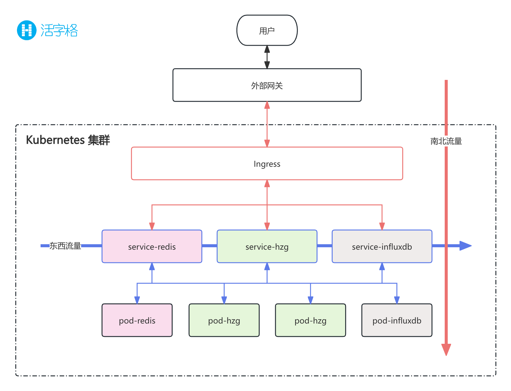

# 网关代理

从整体平台架构出发，网关负责的是整个集群南北流量的管控。而活字格只是 Kubernetes 生态中的一个应用。因此，活字格集群方案中，并没有在初始配置中加入网关部分。对于流向活字格的南北流量，需要依赖于 kubernetes 的 ingress，或者自行在集群外部构建网关服务进行流量的管控与代理。

> [!NOTE]
> 在一个标准的集群网络中，存在两个方向的网络流量，分别是南北流量和东西流量。
> 
>
> -   南北流量又称为纵向流量，主要指从请求端一直打到真正处理的服务端的全网络链路。在 Kubernetes 集群中，负责处理此方向流量的模块是 `Ingress`
> -   东西流量又称为横向流量，主要指内部服务与服务之间的相关通信的全网络链路。在 Kubernetes 集群中，则是由`Service` 来负责。

## 外部网关

考虑到引入 Ingress，会增加您对 Kubernetes 的认识复杂度以及维护成本，这里建议只配置外部网关即可，默认选择 Nginx，示例配置如下：

```nginx
user nginx;
worker_processes auto;
error_log /var/log/nginx/error.log;
pid /run/nginx.pid;

include /usr/share/nginx/modules/*.conf;

events {
    worker_connections 1024;
}

http {
    log_format  main  '$remote_addr - $remote_user [$time_local] "$request" '
                      '$status $body_bytes_sent "$http_referer" '
                      '"$http_user_agent" "$http_x_forwarded_for"';

    access_log  /var/log/nginx/access.log  main;

    sendfile            on;
    tcp_nopush          on;
    tcp_nodelay         on;
    keepalive_timeout   65;
    types_hash_max_size 2048;

    include             /etc/nginx/mime.types;
    default_type        application/octet-stream;

    # 或更大值，比如90s，根据你的需求设置
    proxy_read_timeout 600s;
    # 同样，根据需要增大这个值
    fastcgi_read_timeout 600s;
    client_max_body_size 1G;

    include /etc/nginx/conf.d/*.conf;

    upstream forguncy_servers {
        ip_hash;
        # 集群中node节点：svc端口
        server <node-1-ip>:<svc-fgc-port>;
        server <node-2-ip>:<svc-fgc-port>;
        server <node-3-ip>:<svc-fgc-port>;
        server <node-4-ip>:<svc-fgc-port>;
    }
    # 管理控制台
    server {
        listen 22345;
        location / {
            proxy_pass http://forguncy_servers;
            proxy_http_version 1.1;
            proxy_set_header Upgrade $http_upgrade;
            proxy_set_header Connection "upgrade";

            proxy_set_header X-Real-IP $remote_addr;
            proxy_set_header X-Forwarded-For $proxy_add_x_forwarded_for;
            # 确保传递正确的 Host 头
            proxy_set_header Host $http_host;
        }
    }

    # app
    server {
        listen 80;
        location / {
            proxy_pass http://forguncy_servers;
            proxy_http_version 1.1;
            proxy_set_header Upgrade $http_upgrade;
            proxy_set_header Connection "upgrade";

            proxy_set_header X-Real-IP $remote_addr;
            proxy_set_header X-Forwarded-For $proxy_add_x_forwarded_for;

            proxy_set_header Host $http_host;
        }
    }

}
```

-   使用 `ip_hash` 将流量按照轮询的方式打到每个 node 上。
-   对管理控制台和活字格应用配置反向代理。

> [!TIP]
> 您可以参阅[这里](/solution/gateway/introduction)学习 Nginx 的使用场景以及反向代理的具体说明。

## Ingress

如果您需要为 Kubernetes 集群配置 Ingress。请确保开启 Ingress 的会话保持选项：

```yaml
nginx.ingress.kubernetes.io/affinity: "cookie"
nginx.ingress.kubernetes.io/session-cookie-name: "route"
nginx.ingress.kubernetes.io/session-cookie-expires: "172800"
```
