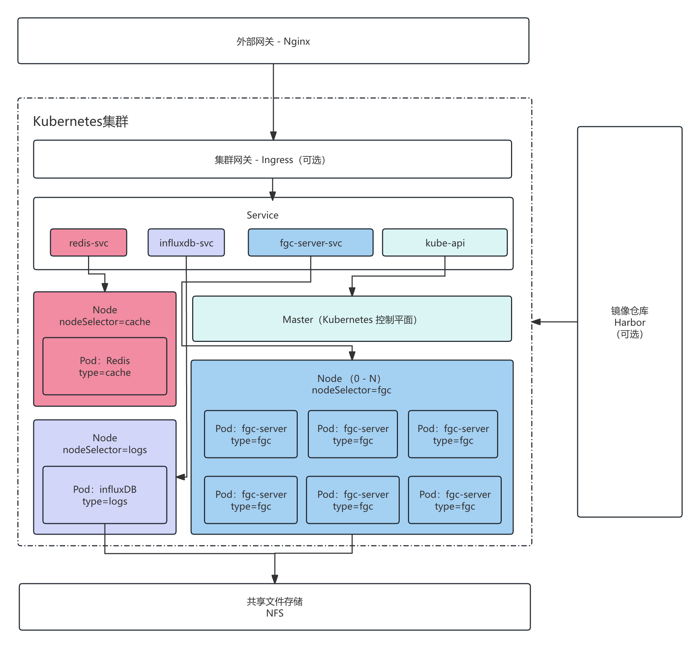
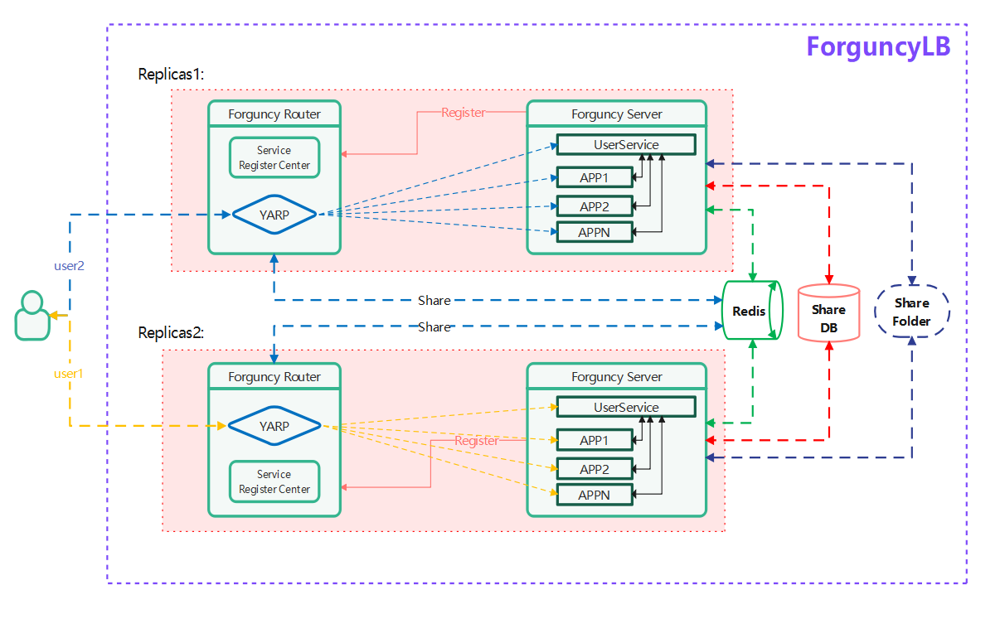

# 简介

负载均衡（Load Balance）是一种将工作任务分摊到多个操作单元上进行执行的技术，是集群技术（Cluster）的一种应用。通过将负载（工作任务）进行平衡、分摊到多个操作单元上进行运行，可以提高并发处理能力，从而提高应用处理性能。

负载均衡技术的基本原理是通过运行在前端的负载均衡服务器，根据执行的负载均衡算法，将流量分配到后端服务器上，从而提高整个系统的扩展能力，实现服务的并行扩展，同时，负载均衡技术还可以起到对外网屏蔽内网服务器，从而提高系统的可用性。

## 活字格负载均衡架构

### 集群整体架构

-   活字格集群的底层平台基座为 Kubernetes。
-   活字格集群包含 3 个服务，分别是：
    -   `fgc-server` : 主服务。
    -   `redis`：缓存共享服务。
    -   `influxDb`：日志数据库服务。
-   活字格集群需要共享文件服务来保证集群数据的共享与持久化。
-   如果有内网需求，请配置私有化的镜像仓库。
-   为保证集群安全与高可用，推荐集群外部架设网关服务。

### 活字格服务 Pod 架构

-   活字格的应用运行在 Pod 内部的 fgc-server 中。
-   活字格服务器（fgc-server）通过统一的路由（Forguncy Router）对外暴露端口（默认端口号 80），路由将所有请求到端口 80 的流量路由到不同的 App 以及 UserService。
-   活字格负载均衡基于会话保持功能。
