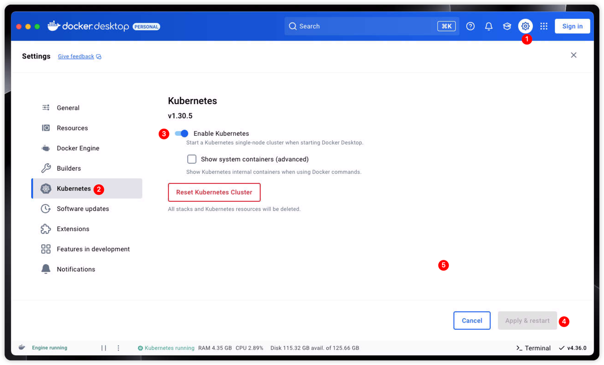
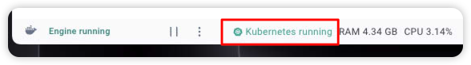

# Docker Desktop

[Docker Desktop](https://www.docker.com/) 是一个一键安装的应用程序，适用于您的 Mac、Linux 或 Windows 环境，可让您构建、共享和运行容器化应用程序和微服务，也是现在 docker 官方默认的可视化安装方式。

它提供了一个简单的 GUI（图形用户界面），可让您直接从您的机器管理您的容器、应用程序和镜像。

当您安装了 Docker Desktop 后，也就意味着您的环境中已经包含了如下功能：

-   Docker Engine
-   Docker CLI
-   Docker Build
-   Docker Compose
-   Kubernetes

是的，Docker Desktop 中已经包含了一个基于 minikube 的 Kubernetes 环境，您只需要开启其功能即可。

## 开启 Kubernetes 集群

当您安装好 Docker Desktop 后，按照如下操作进行集群的开启：

1. 从 Docker Desktop 仪表板中，请选择 **Setttings** 选项。
2. 在左边侧栏选择 **Kubernetes**。
3. 勾选复选框 **Enable Kubernetes**。
4. 选择 **Apply & Restart**。



> [!TIP] 镜像无法下载？
> 由于网络原因，可能会存在镜像拉取失败的情况。此时我们可以选择使用[镜像加速](./mirror.md)来解决该问题。

当 Kubernetes 启动并成功运行时，Docker Desktop 的底部状态栏和 Docker 菜单会额外显示一个状态栏。



## 与您的集群交互

Docker Desktop 并没有内置集成 [kubectl](./kubectl)，您需要手动进行安装，之后可以使用它来访问您的新集群：

```bash
# 查看节点信息
kubectl get nodes

# 查看 Pod 信息
kubectl get pods -A
```
