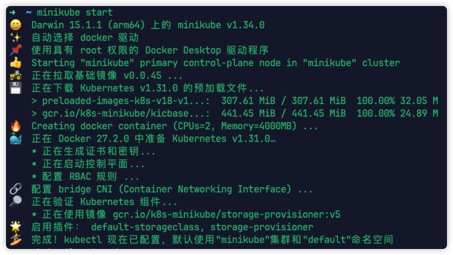

# minikube

[minikube](https://minikube.sigs.k8s.io/docs/) 可在 macOS、Linux 和 Windows 上快速设置本地 Kubernetes 集群，专注于简化 Kubernetes 的学习和开发。

> [!NOTE] 您需要什么
>
> -   2 个或更多 CPU
> -   2GB 空闲内存
> -   20GB 空闲磁盘空间
> -   互联网连接
> -   容器或虚拟机管理器，例如：[Docker](https://docs.docker.net.cn/engine/install/)（推荐）、[VirtualBox](https://www.virtualbox.org/wiki/Downloads)、[Hyper-V](https://learn.microsoft.com/zh-cn/virtualization/hyper-v-on-windows/) 等。

## 下载安装

您可以访问 minikube 提供的[安装命令配置界面](https://minikube.sigs.k8s.io/docs/start/?arch=%2Fmacos%2Farm64%2Fstable%2Fbinary+download)，按照您当前环境进行配置，将获取到的命令直接在终端命令行中运行即可。


> [!TIP] 镜像无法下载？
> 由于网络原因，可能会存在镜像拉取失败的情况。此时我们可以选择使用[镜像加速](./mirror.md)来解决该问题。

## 启动集群

完成 minikube 的安装后，只需一条命令即可完成在 minikube 下的 Kubernetes 环境启动：`minikube start`。



可以使用 `status` 命令查看集群状态：

```bash
minikube status
```

## 与您的集群交互

如果您已经安装了 [kubectl](./kubectl)，您现在可以使用它来访问您的新集群：

```bash
# 查看节点信息
kubectl get nodes

# 查看 Pod 信息
kubectl get pods -A
```

## 管理您的集群

minikube 集成了一整套命令，方便我们直接管理集群。这里只列出常用命令，您可以访问[命令文档](https://minikube.sigs.k8s.io/docs/commands/)了解更多。

-   暂停集群，不影响已部署的应用程序

    ```bash
    minikube pause
    ```

-   取消暂停集群

    ```bash
    minikube unpause
    ```

-   停止集群

    ```bash
    minikube stop
    ```

-   删除集群

    ```bash
    minikube delete
    ```

-   将指定目录挂载到 minikube 上

    ```bash
    minikube mount [flags] <source directory>:<target directory>
    ```

-   管理插件

    插件是 minikube 的维护扩展，用于为集群提供附加功能。

    ```bash
    # 查看插件列表
    minikube addons list

    # 开启某个插件功能
    minikube addons enable <addon name>

    # 关闭某个插件功能
    minikube addons disable <addon-name>
    ```
