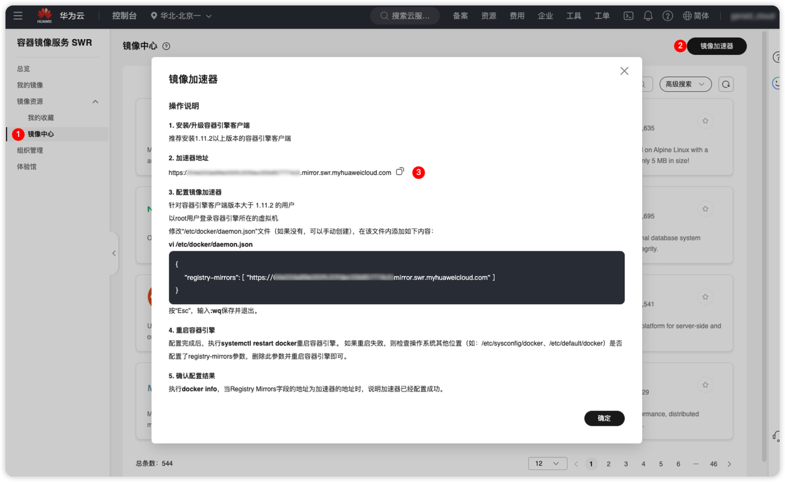

# 镜像加速

镜像加速是指通过优化镜像下载的速度和效率，加速从镜像仓库拉取容器镜像的过程。这一技术在网络质量不佳或镜像仓库地理位置较远时尤为重要。

容器镜像通常托管在公共或私有的镜像仓库中，如 Docker Hub、Google Container Registry（GCR）、阿里云镜像服务等。当用户在国内或低速网络环境中拉取镜像时，可能会遇到下载缓慢的问题，这会显著影响容器启动和部署的效率。

通过配置镜像加速服务，可以显著提升镜像的下载速度，从而减少容器化应用的启动时间。

## 获取镜像加速服务

目前，各大云厂商都已经面向个人用户提供了镜像加速服务。您可以选择一个合适的服务厂商，获取其镜像加速服务。

> [!TIP]
> 如果您是离线环境，无法访问云服务，可以选择自行构建私有化的[镜像仓库](./offline#私有化镜像仓库)！同样可以实现镜像加速的效果。

这里以华为云为例，其他厂商类似。

1. 登录[容器镜像服务控制台](https://console.huaweicloud.com/swr/#/swr/dashboard)
2. 在左侧导航栏选择“镜像资源 > 镜像中心”。
3. 点击**镜像加速器**，复制加速器地址。



## 配置加速器

获取到镜像加速地址后，您需要将其加入到您的容器运行时配置中。

### Docker

-   如果您是通过命令行安装的 docker，那么请直接编辑 `/etc/docker/daemon.json` 文件（如果文件不存在，请直接创建）。
    ```json
    {
        "registry-mirrors": ["https://<your-mirror-url>"]
    }
    ```
-   如果您的 docker 拥有可视化界面，例如 Docker Desktop，直接在 “设置界面 > Docker Engine” 中进行配置。配置内容和上文相同。

配置完成后，可通过如下命令查看字段 Registry Mirrors 是否变更为指定镜像加速器

```bash
docker info
```

也可以拉取一个镜像进行测试。

```bash
docker pull nginx
```

### Containerd

对于 Kubernetes 较新的版本，官方已经推荐容器运行时为 containerd。这是一个原生支持 CRI 的容器运行时，因此更轻量且更高效。

基于 containerd 的镜像加速配置，您可以参考[容器运行时](./kubernetes/container-running)。
