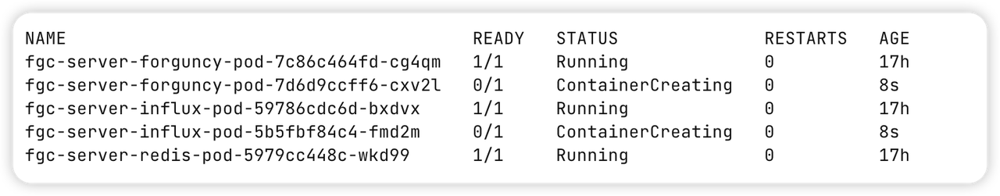

# 升级

本节介绍活字格集群的升级操作。

## 直接升级

如果你的 chart 中定义的活字格镜像版本为 latest。那么只需要拉取最新的镜像。之后删除原本运行的活字格 pod 即可。新的 pod 会自动使用最新版本的镜像进行初始化。

```bash
kubectl delete pod <forguncy-pod-name> -n <fgc-namespace>
```

-   `<forguncy-pod-name>`：活字格 pod 名称。
-   `<fgc-namespace>`：活字格服务的命名空间

> [!IMPORTANT] 容器拉取策略
> 为了确保避免镜像自动升级版本导致应用出现问题，请在 deployment 中配置镜像拉取策略为 `IfNotPresent`。这样只有当我们手动更新镜像后，才会有升级的行为。

尽管直接升级简单直接，但是为了更好的版本管理与维护，建议通过 Helm 执行升级。

## 通过 Helm 升级

您可以通过修改 release 配置后，使用 `helm upgrade` 命令。

release 版本是增量修订。每次安装，升级或回滚时，修订版本号都会增加 1。第一个修订版本号始终为 1。 您可以使用 `helm history [RELEASE]` 查看特定版本的修订版号。

示例，将 chart 配置中 `values.yaml` 中的镜像版本号进行修改后：

```bash
helm upgrade -f values.yaml f fgc-server .
```

> [!NOTE] 跳过打包操作
> 示例中的操作没有执行 `package`，直接在 `values.yaml` 所在的当前的目录直接操作。因此传入的是当前路径 `.`



执行 `upgrade` 命令后，Kubernetes 会自动初始化新的 pod，之后将旧的 pod 进行销毁。

您也可以通过 `helm list` 查看升级后的 release 版本号。

```bash
helm list -n fgc-system
```
