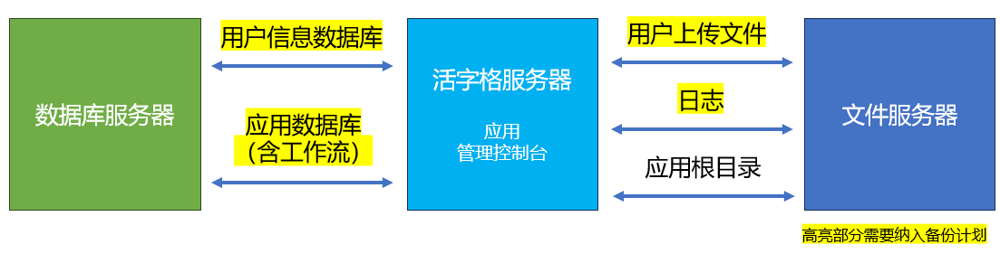

# 生命周期

## 需求调研

使用活字格快速开发原型，确认系统范围、页面风格与核心业务逻辑。

【推荐】“原型不丢弃”是使用活字格开发的优势之一，推荐在原型阶段启用版本管理。
::: info
开启版本管理后，可带来如下好处：
- 每次需求确定与变化可以有效留痕；
- 前方的需求确认结果可以快速同步至后方的开发实施侧。
:::

【推荐】原型开发时，可考虑使用内置库，随时随地给最终用户做演示。

::: info
项目确定下来转为正式开发后，再遵循 [模型设计](../dev/database/domain) 进行优化，利用「内建表转为外联表」，将其转到外联数据库中继续开发。
:::

【推荐】需求对接时，请阶段性进入调试页面，向需求用户展示，以确认项目范围和用户体验。

【推荐】对于软件公司来说，原型通常不能用于代替约束项目范围的文件，依然需要准备相关文档来标定交付边界，降低项目风险。

## 设计开发

【推荐】请充分发挥活字格“设计即实现”的优势。除数据库设计之外，其他环节的设计文档可以少写或不写。

【推荐】实际项目中，考虑到活字格开发的效率数倍于编码开发，可适当压缩每一个迭代周期的时长，如 1 周。

::: info
活字格的特点更适合采用敏捷式项目管理模型，充分利用交付周期短的优势，缩短用户等待的时间，及时纠偏，及时上线。
:::

【推荐】活字格开发的项目质量风险比编码开发低，建议在主要业务流程基本走通时，再投入持续发布，启动测试工作。

【推荐】数据库的版本管理虽然不在活字格的“管辖范围”，但对于确保项目运行非常重要。参考数据库。

【推荐】进入测试阶段后，需要建立测试环境和持续发布机制，确保测试环境及时更新，以提升测试工作效率。更多请参考：[配置管理](../dev/configuration/application#环境)。

【推荐】对于性能要求较高、并发量较大的项目，推荐参照生产环境建立压力测试环境，利用第三方压力测试方案进行压测。

【推荐】对于需求相对稳定、质量要求高、项目规模大的项目，可采用成熟的第三方技术方案建立 Web 页面和WebAPI（服务端命令）的自动化测试环境，并将其纳入每日构建中，进一步提升开发质量。

## 验证发布

【推荐】请搭建验证环境，除首次发布之外，每次发布前，均进行验证测试。
::: info
验证环境通常具有与生产环境一致的架构和版本。验证环境的充分测试可以确保应用的新特性不会对生产环境产生影响。

验证测试请重点关注数据库升级。
::::

【推荐】升级操作可能会对用户操作带来影响，推荐选择合适的发布时间，并提前做好沟通。

【推荐】升级操作前，请在活字格管理控制台上，使用「备份」功能对应用进行备份，以防万一。

【推荐】升级过程中会涉及到对协同仓库的分支进行覆盖与删除，需确保主分支与生产环境保持一致。更多请参考：[版本控制与协作](../dev/cooperation)。

## 线上运维

【推荐】为了提升可维护性，在构建生产环境时，首先需要配置文件服务器和数据库服务器。不推荐在生产环境中使用默认的用户信息数据库和各种存储路径。

【推荐】活字格没有提供开箱即用的监控方案，请优先采用成熟的监控方案。

::: tip
- 系统级监控方式与编码开发一致，推荐使用Zabbix等主流的技术方案等；
- 应用的可用性监控，推荐采用云服务商提供的分布式监控服务，如阿里云的云监控等。
:::

【推荐】为不同的环境启用不同的日志策略，详情请参考：[服务配置-日志策略](../operation/service)。

【推荐】采用成熟方案建立数据库备份机制，启用内置功能做好应用备份。

::: tip
- 使用外联库时，数据库的备份机制请参考厂商提供的文档和工具。在指定备份计划时，除了业务数据库外，还需同步备份用户信息数据库（仅限将用户信息数据库配置为外联库的场景）。
- 应用（含应用、流程和报表）的备份，推荐使用活字格内置的【定时备份配置】功能，如果需要接入现有的自动化备份机制，推荐使用 [命令行备份](https://www.grapecity.com.cn/solutions/huozige/help/docs/appmaintenance/commandlinebackup)。
- 此外，运维人员还需要使用第三方工具，将以下内容纳入备份计划：
	- 用户信息数据库
	- 应用的数据库
	- 附件文件夹
:::