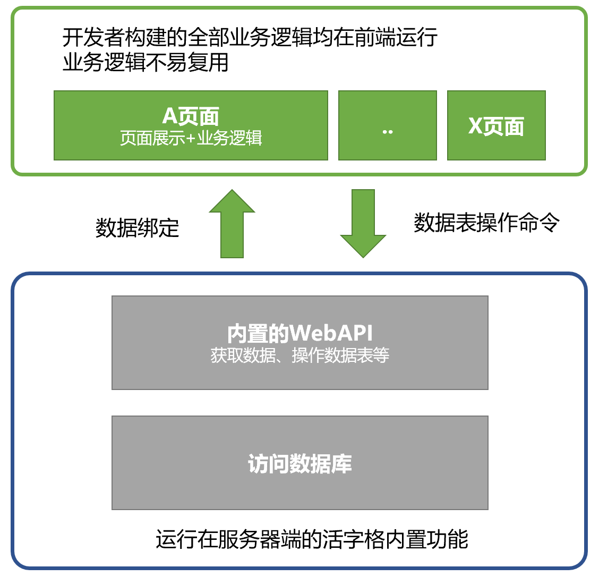
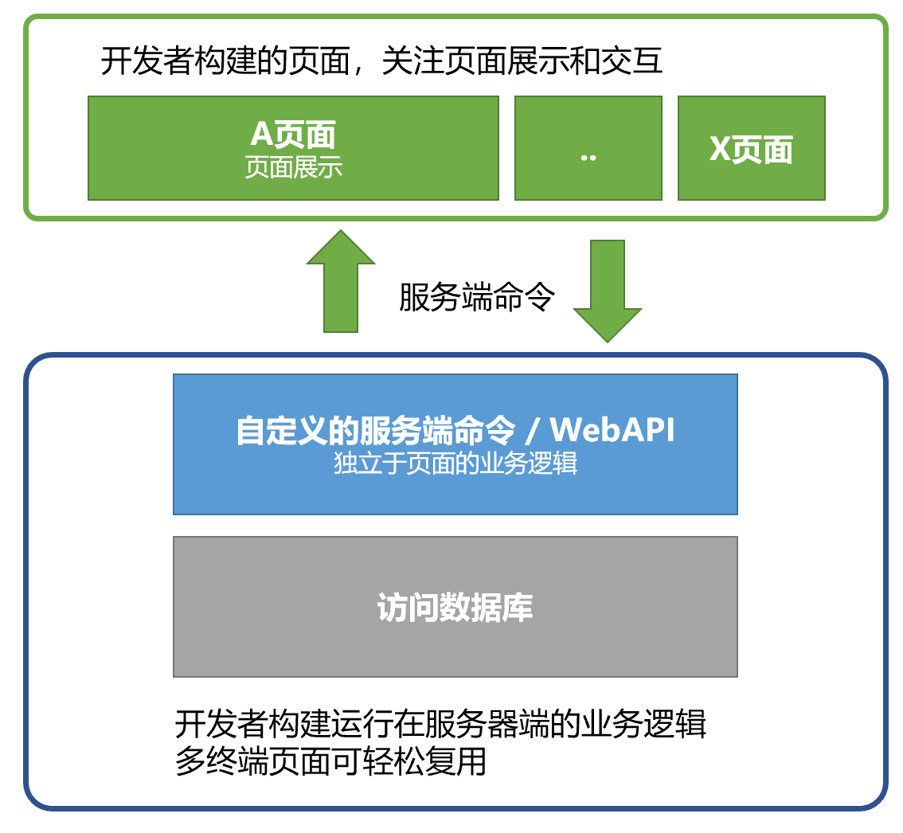

# 系统架构

无数项目证明，良好的架构可以有效提升系统的可维护性，持续降低软件维护和迭代成本。在企业软件开发领域，“进行开发前，先确立良好的架构”已经成为了行业共识。在编码开发阶段，软件架构通常由专职的系统架构师或经验丰富的高级程序员制定，过程中除了需要具备行业知识、软件架构相关的技巧和经验外，还需要充分了解项目用到的软件开发框架的特点。

::: info
软件架构是构建计算机软件实践的基础。与建筑师设定建筑项目的设计原则和目标，绘图员以此作为画图的基础一样，开发工程师的构建工作需要基于架构师提供的软件架构展开。通常意义上，软件架构中定义和设计了软件的模块化，定义了模块之间的交互，确定了用户界面风格、对外接口方法等。软件架构的概念提出于1960年代，在1990年代成熟并广泛用于中大型软件开发。
:::

活字格内置了为中大型软件应用的多层架构，符合前后端分离、无状态等特点，并提供了包含用户管理、权限认证、日志、运维等非功能性模块。所以，使用活字格开发时，架构设计工作被显著简化。通常情况下，您仅需要选择部署架构，然后参考对应的最佳实践开发即可。

【推荐】在中大型系统中，不同的模块可以采用不同的架构开发。这种做法通常见于高低搭配的开发团队，核心、复杂模块由高级低代码开发工程师采用RPC方式开发，简单模块由初级低代码开发工程师采用单体架构开发。

【推荐】复杂度低、规模更小的非关键型应用或模块可以采用单体架构开发，能大幅降低开发工作量。

::: info 单体架构说明
单体架构是分布式系统中最简单的部署架构，通常用于个人开发者构建非关键型应用（不涉及企业核心业务、规模通常较小、对不需要经常修改和维护，如数据填报与自动汇总等）。在使用活字格时，单体架构最主要的特征是在页面中利用数据绑定、公式和命令完成全部业务逻辑。

:::

【推荐】对于团队开发的应用或复杂度较高的应用或模块，强烈推荐采用前后端分离（RPC架构）。

::: details RPC架构
单体架构的开发效率最高，但也存在一系列问题，如业务逻辑和页面元素杂糅在一起，可维护性差；页面获取的数据多于实际展示所需，性能无法保证等。大量项目实践表明，这些问题在中大型系统或团队协作中都会显著降低整体效率。RPC架构可以有效解决这些问题。

RPC架构中，业务逻辑以服务端命令的形式运行在服务端，前端仅关注于页面交互，最终实现前后端解耦，让多个终端的多个页面可以复用同一套业务逻辑。这种做法也被活字格的用户形象地称为“前后端分离”。在使用活字格时，RPC架构最主要的特征是服务端命令的使用。即除了简单的列表展示和单据增删改之外，其它业务逻辑均采用服务端命令来实现。

:::

【参考】在常规的活字格项目开发过程中，架构的选择并非单一不变，可以酌情混用前后端分离架构和单体架构的开发思想。

::: tip
在获取数据，如填充列表、表单时采用单体架构的「数据绑定」，而在创建/修改/删除数据或执行业务操作时采用前后端分离架构，通过调用「服务端命令」来实现。
:::

【参考】关于团队规模与应用规模的参考：

| 团队规模 | 部门级应用 | 企业级应用   | 集团级应用   |
|:-----|:------|:--------|:--------|
| 个人   | 单体    | RPC     | /       |
| 小型团队 | RPC   | RPC     | SOA/微服务 |
| 中、大型团队| RPC   | SOA/微服务 | SOA/微服务 |

::: info
- 部门/小组级应用指仅作用于部门或小组内部的应用，通常不会涉及企业核心业务；
- 企业级应用是企业软件中最常见的场景，不论使用者的人数多少，只要涉及到企业的核心业务，或应用到多个部门的应用都是企业级应用；
- 集团型应用在企业级应用的基础上增加了集团化管理相关的功能和更高的技术与运维要求。
:::