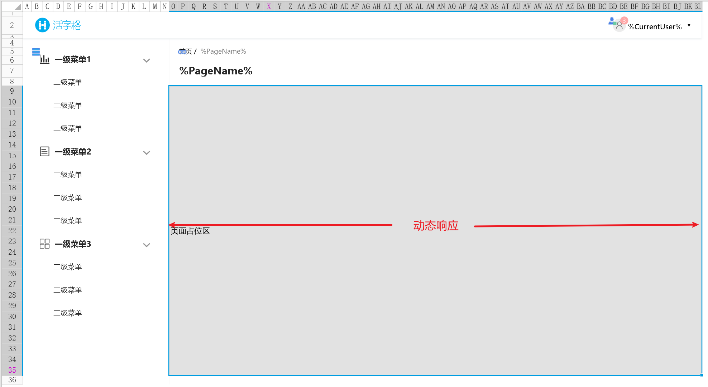
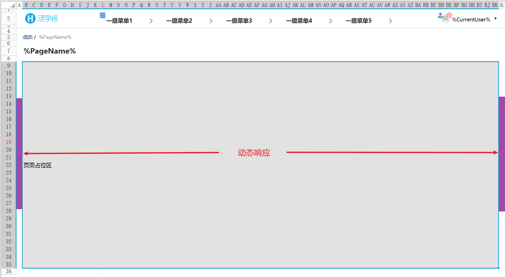
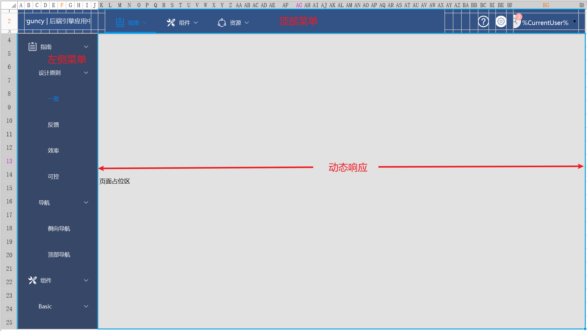

# 适配方案

对于布局的适配方案，建议使用「母版页」的特性来实现。

**左右布局**

常被用于左右布局的设计方案中，最常见的做法为将左边的导航栏固定，右边的「页面占位区」去进行动态缩放。

**上下布局**

常被用于上下布局的设计方案中，常见的作坊是将顶部的导航栏固定，下方的「页面占位区」作为工作区进行动态缩放。
建议在设计时考虑对于两边留白的最小值定义。

**L型布局**

对于复杂的中后台门户界面或后端配置台中，单一的菜单已经无法充分体现业务的维度，因此，我们会考虑将顶部导航与侧边导航进行组合，
必要时可以选择标签页和打开标签页命令协同使用。

::: tip 👉 示例工程

关于L型布局的样例，可以参考Demo工程：[统一门户管理框架](https://marketplace.grapecity.com.cn/ApplicationDetails?productID=SP2212230001&productDetailID=D2301130010&tabName=Tabs_detail)

:::