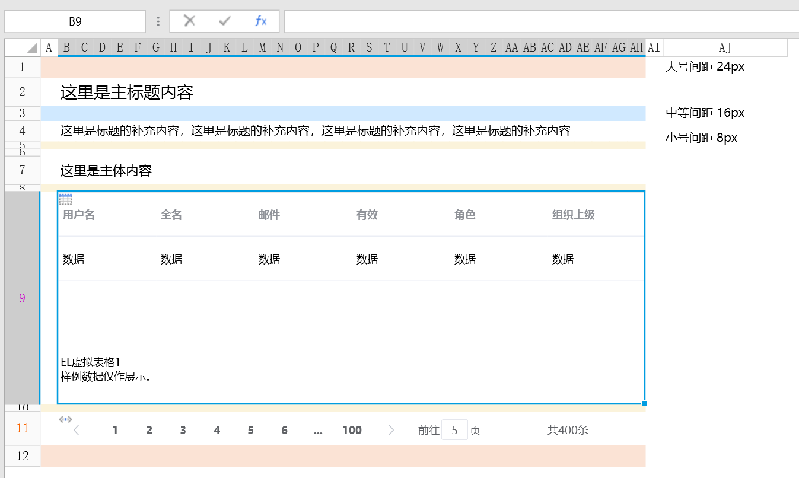
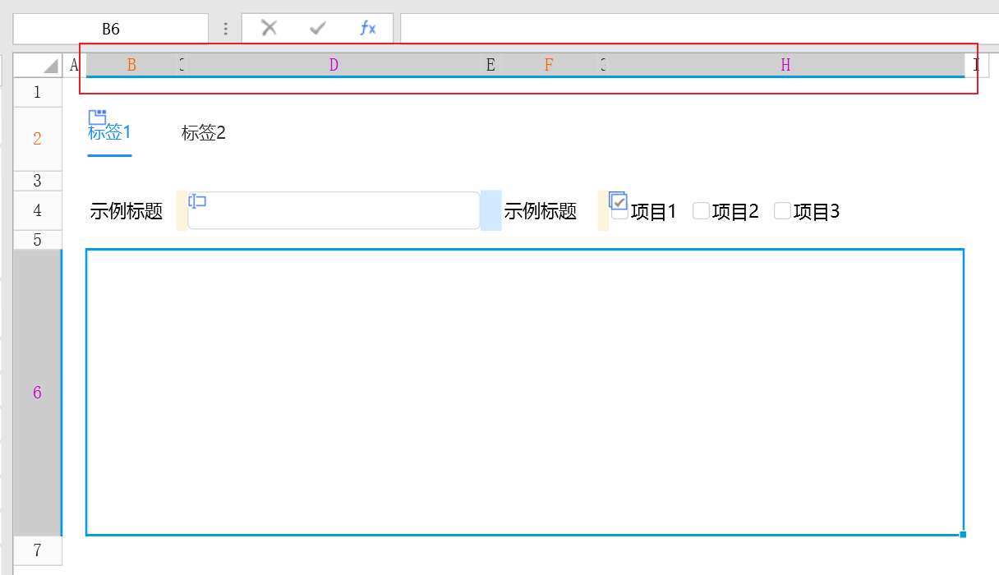

# 距离

如果信息之间的关联性越高，它们之间的距离就应该越近，也越接近一个整体； 反之，则它们的距离应该越远，也越像多个个体。良好的距离设计，可以让用户对于页面结构与信息层级一目了然。

## 纵向间距

【推荐】通过「小号间距」、「中号间距」、「大号间距」这三种规格来划分信息层次结构。

【推荐】在特定的场景下，您可以通过加减「基础间距」的倍数，或者增加元素来拉开信息层次。

## 横向间距

【推荐】为了适应不同尺寸的PC屏幕，在纵向间距的间距结构基础上，需配合「行列高」中的「范围模式」与「自适应」，模拟栅格布局来排布页面元素。
