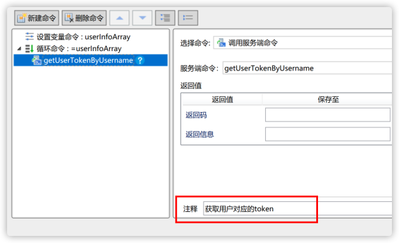

# 文档注释

## 程序注释

【推荐】隐藏区域中的单元格，必须设置「单元格注释」描述隐藏数据的作用与效果。

【推荐】命令发生修改时，请留意对应的注释也应当进行修改。

【推荐】命令内部的注释简短且清晰。专有名词与关键字请保持原文。

::: danger ⚠️ 反例

“TCP连接超时”注释为“传输控制协议连接超时”。

:::

【推荐】请谨慎对待「禁用命令」功能。如果禁用是必要的，请使用注释说明。如果该命令无用时，删除比禁用更为合适。

【推荐】良好的命令风格与命令结构是自解释的。避免出现注释滥用。

::: danger ⚠️ 反例

服务端命令 `getUserTokenByUsername()` 已经描述得非常清晰，注释无意义。

:::

【参考】参数的备注字段可以在大多数场景下取代注释。

## 文档编写

【推荐】如果您的项目中使用拼音或者其缩写进行命名，请维护缩写与全名对应的文档。

【推荐】如果您的系统中使用了代码编程，请维护相关的文档说明。

::: info 📘 说明

代码编程涉及的部分：
- JavaScript 编程；
- CSS；
- 自定义服务端编程；
- 自定义插件；
- 自定义安全提供程序；
- 数据库编程，如存储过程、复杂视图、触发器等。

:::

【推荐】请为系统中调用的 api 维护相关文档说明。

::: info 📘 说明

系统中调用的 api 包括「服务端命令」、第三方的 api 接口、第三方的 SDK、自定义服务端编程等。

:::

