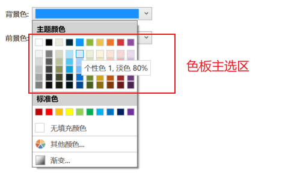

# 界面设计

## 色彩

【推荐】在色彩选择时，非必要情况下，请严格从色板主选区的主题颜色中进行选择。

::: info 📘 说明

色板主选区的颜色以及官方插件的主色均是主题色的引用，主题色变更时，所有引用主题色的内容都可以同步变化，从而保持色彩的全局一致性。

::: details 示例

:::

## 字体

【推荐】使用定制字体，请务必留意在服务器上安装相同的字体，避免乱码。

## 样式

【推荐】在项目构建初期，优先确定项目中使用的「单元格类型」所对应的样式设计。

【推荐】沉淀属于自己团队的样式模板（由丰富的单元格样式、模板页面、组件、自定义CSS构成），通过「活字格文件导入」进行项目的基础样式构建。

## 加载

【推荐】选择「渐进式加载」时，需要留意隐藏数据的渲染顺序，避免出现“幻读”现象。

::: info 📘 说明

渐进式加载会将页面加载的过程体现出来。如果页面数据设置为先显示后隐藏，会出现用户在页面加载时看到的数据在页面加载完成后消失的现象。

正确方式应当将行列显示方式设置为：默认隐藏，「设置行列布局」命令将需要展示的数据进行呈现。

:::

## 页面

【推荐】设计响应式页面时，请不要使用「页面拉伸模式」。优先选择使用页面中行/列宽的「范围模式」。

::: info 📘 说明

「页面拉伸模式」为早期版本的页面自适应方案，属于被淘汰的技术。出于对老版本兼容性的考量，仍存在于设计器中，但已不推荐在新项目中使用。

:::

【推荐】在「母版页」中标定画布尺寸，请考虑应用所在终端容器的最小容纳尺寸。

::: info 📘 说明

活字格生成的是 Web 应用，与第三方进行界面整合的方式为页面嵌套。因此，不仅要考虑真实屏幕的尺寸，也应当考虑嵌套容器的尺寸。

例如应用内嵌至 APP、小程序时，出于美观考量，第三方平台很可能会为嵌套容器赋予专属的 `margin` 与 `padding` 属性。
画布尺寸的标定应当减去这些额外的容器占用尺寸。

:::

【参考】为「单元格类型」赋予响应式能力时，在确保最小宽度的前提下，「范围模式」只设置在必要行列上即可。

::: info 📘 说明

在合并单元格中放置「单元格类型」，是活字格设计页面中的常用操作。画布中经常会出现一个「单元格类型」覆盖多个行列的情况。

然而，多个行列合并与一个行列在相同宽高的情况下呈现效果相同。将单元格类型放置在一个行列上，更符合 [效率原则](../../dev/principle#效率)。

:::

【参考】避免出现预期外的横向滚动条，
请确保页面中所有列宽设置的「固定模式」的总计宽度 + 「范围模式」的总计最小宽度 小于等于 [标定画布](../../design/layout/canvas)的最小宽度尺寸；

::: info 📘 说明

活字格的页面宽度占位优先级为：「固定模式」 = 「范围模式-最小值」 = 「自适应模式」 > 「范围模式-占比」。

只有当设置为「固定模式」、「范围模式-最小值」与「自适应模式」的列完成占位后， 当前窗口剩余的空间才会按照设置的比例分配给「范围模式-占比」的列。

当页面宽度变化后，只有「范围模式-占比」的列宽度会随之变化。

:::

## 功能性

【推荐】避免在页面中加入较多与展示数据无关的复杂逻辑。

::: info 📘 说明

活字格的可视化设计决定了许多功能可以在页面侧完成。但根据 MVC 理论，页面负责视图的工作，无需抢夺模型和控制器的工作。

此外，PC 页面与移动页面是分开维护的，为保证多端页面处理逻辑的一致性，我们需要尽可能的将逻辑维护在一处。

因此，任何和展示数据无关的逻辑都应当尽可能得交由数据模型与服务端命令来负责。

:::

【推荐】保证页面的功能性唯一，展示页、维护页与打印页尽量不选择共用。

::: info 📘 说明

涉及到多表数据以及权限管控的复杂场景下，展示与维护共用同一页面会导致单页面的复杂度急剧增加。因此，明确区分页面功能会带来更好的维护效率。

- 展示页：仅用于数据的呈现，数据所在的单元格，其「单元格类型」通常为空；
- 维护页：用于数据的编辑，也承担了数据呈现的功能，数据所在的单元格为可编辑的各种「单元格类型」；
- 打印页：仅用于数据的打印，当前页面的所有配置都只为打印功能做服务。

:::

## 多终端

【推荐】「跳转页面」、「弹出页面」、「设置启动页」等在配置页面时，请选择标准页面（PC页面）。
任何「手机页面」在非必要下禁止出现在上述命令的设置项中。

::: info 📘 说明

只需要将 PC 页面与手机页面做好关联，活字格会按照终端自动切换。 否则，会出现PC页面与手机界面互相跳转的非预期现象。

:::

【推荐】除非必须在移动端提供类Excel的编辑功能，
否则在移动端的批量数据展示场景中，建议使用「EL-表格」或「图文列表」。

【参考】在处理能力受限的 PDA 设备中操作「图文列表」，推荐用分页代替按需加载，
避免页面元素累计过多导致页面响应变慢。

【参考】表格中的列合并需要更长的渲染时间，不推荐用于 CPU 能力弱的 PDA 等移动设备。

## 资源

【推荐】如果客户端可以联网，强烈推荐为静态资源启用CDN。